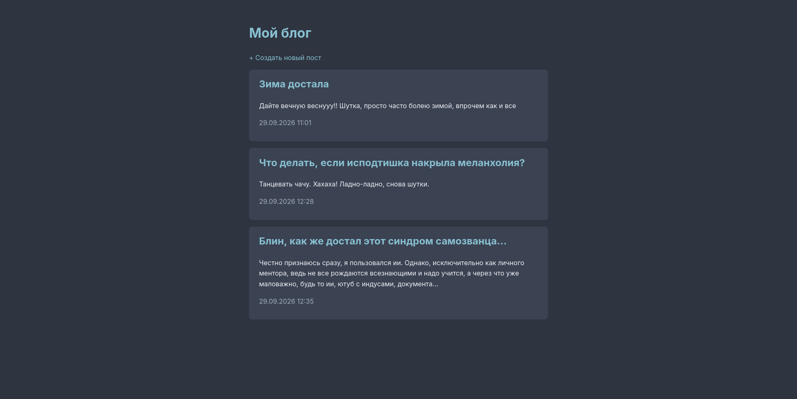
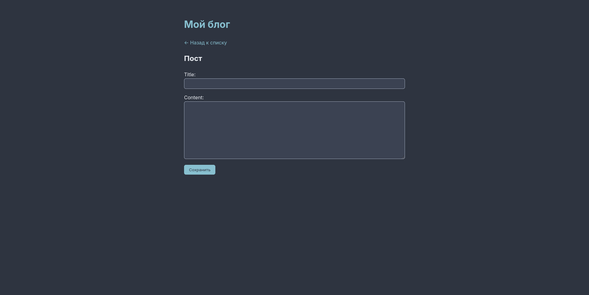
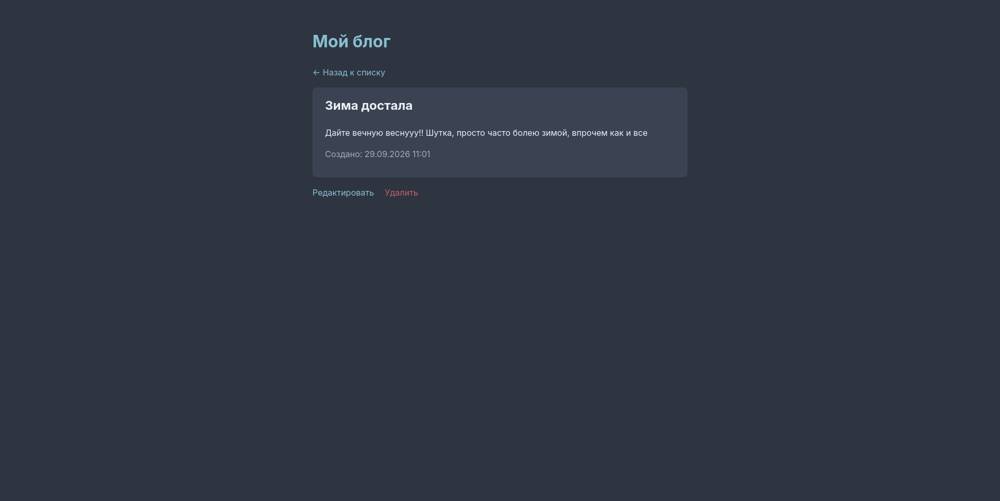
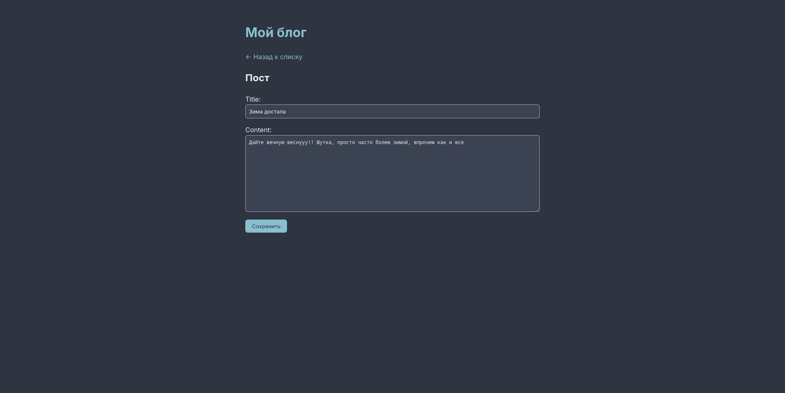

# Blog

Блог на Django с REST API. Учебный проект, в котором я прошёл полный цикл бэкенд-разработки: от модели и CRUD до контейнеризации.

## Возможности

- Список постов и страница отдельного поста
- Создание, редактирование и удаление постов через сайт
- Админ-панель Django
- REST API для постов (`/api/posts/`) на Django REST Framework
- Запуск одной командой через Docker Compose

## Скриншоты







## Стек

- Python 3.14, Django 6.1
- Django REST Framework
- PostgreSQL 16
- Docker, Docker Compose
- python-decouple (конфигурация через `.env`)
- Git

## Запуск

Нужны Git и Docker.

```bash
git clone <ссылка-на-репозиторий>
cd <папка-проекта>
cp .env.example .env
```

Открой `.env` и задай свои значения для `SECRET_KEY` и `DB_PASSWORD`. Значение `DB_HOST=db` менять не нужно, это имя сервиса с базой внутри Docker.

```bash
docker compose up -d --build
docker compose exec web python manage.py migrate
docker compose exec web python manage.py createsuperuser
```

Проект доступен по адресам:

- Сайт: http://127.0.0.1:8000/
- Админка: http://127.0.0.1:8000/admin/
- API: http://127.0.0.1:8000/api/posts/

Остановить: `docker compose down` (данные базы сохраняются в volume).

## Структура

```
blog/            настройки проекта и корневые URL
posts/           приложение: модель, views, формы, сериализаторы, шаблоны
Dockerfile       образ приложения
docker-compose.yml  сервисы web и db
```

## API

| Метод | URL | Действие |
|---|---|---|
| GET | `/api/posts/` | список постов |
| POST | `/api/posts/` | создать пост |
| GET | `/api/posts/<id>/` | получить пост |
| PUT/PATCH | `/api/posts/<id>/` | обновить пост |
| DELETE | `/api/posts/<id>/` | удалить пост |

## Планы

- Авторизация пользователей и авторство постов
- Деплой на сервер